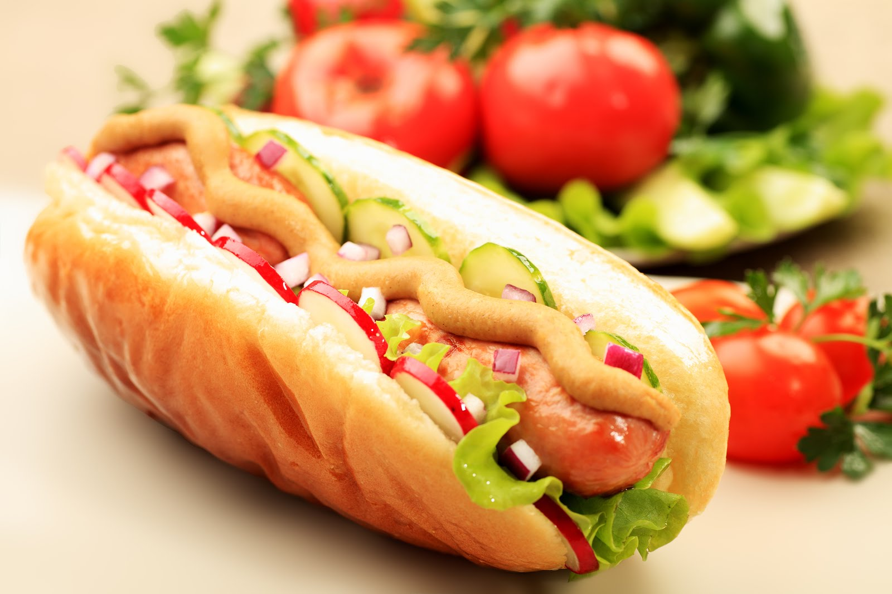

# hotDog or notHotDog
This repo is inspired from Jin Yang's cool startup idea called "SeeFood" from HBO's Silicon Valley tv series.

I have used Google TensorFlow's incpetion model. Inception has been battle-tested, delivering world-class results in the widely-acknowledged ImageNet Large Scale Visual Recognition Challenge (ILSVRC). It’s also designed to be computationally efficient, using 12x fewer parameters than other competitors, allowing Inception to be used on less-powerful systems.<br/>

Retraining has been done by replacing last layer of Inception model and I have used around 250 images so the accuracy for certain images might be low. <br/>

## Getting started
1. Install the TensorFlow. 
Instructions can be found here : https://www.tensorflow.org/install/
2. Clone this repository and start terminal.
2. Run `python hotDogNotHotDog.py test/dog.jpeg`

3. Wait for the model's prediction.
4. Here's the result you should expect if things work correctly:
```
not hot dog          : 0.90415
hot dog              : 0.09585
```
5. For hot dog run `python label_dog.py test/hotdog.jpg`

6. The result comes out as 
```
hot dog              : 0.99771
not hot dog          : 0.00229
```
